# AI-Powered Employee Helpdesk Agent for Microsoft Teams

An intelligent HR helpdesk bot deployed on Microsoft Teams that combines RAG-based policy document retrieval with structured Dataverse queries for personalized HR support.

## 🚀 Features

- **Hybrid Knowledge Retrieval**: Intelligently routes between policy documents (RAG) and personal data (Dataverse)
- **Agentic HR Workflows**: Leave applications, balance checks, approval workflows
- **Native Teams Integration**: SSO authentication, Adaptive Cards for rich UI
- **Multi-turn Conversations**: Slot filling for complex leave request transactions
- **Manager Approvals**: View and process pending leave requests

## 🏗️ Architecture Diagram

```mermaid
flowchart TB
    subgraph Teams["Microsoft Teams"]
        User[👤 Employee]
        TeamsApp[Teams App]
    end

    subgraph Azure["Azure Cloud"]
        subgraph AppService["Azure App Service"]
            Bot[🤖 Teams Bot<br/>bot.py]
            Agent[🧠 LangChain Agent<br/>hr_agent.py]
            
            subgraph MCP["MCP Servers"]
                DVServer[Dataverse<br/>Server]
                RAGServer[RAG<br/>Server]
                SPServer[SharePoint<br/>Server]
            end
        end
        
        subgraph Storage["Data Storage"]
            Dataverse[(Microsoft<br/>Dataverse)]
            AISearch[(Azure AI<br/>Search)]
            SharePoint[(SharePoint<br/>Documents)]
        end
        
        AAD[Azure AD<br/>SSO]
    end
    
    subgraph OpenAI["OpenAI"]
        GPT[GPT-4o]
        Embeddings[Embeddings<br/>API]
    end

    User -->|"Message"| TeamsApp
    TeamsApp -->|"Activity"| Bot
    Bot -->|"SSO"| AAD
    Bot -->|"Process"| Agent
    
    Agent -->|"Intent<br/>Classification"| GPT
    Agent -->|"Tool Calls"| MCP
    
    DVServer -->|"CRUD"| Dataverse
    RAGServer -->|"Vector Search"| AISearch
    RAGServer -->|"Embed Query"| Embeddings
    SPServer -->|"Fetch Docs"| SharePoint
    
    Bot -->|"Adaptive Cards"| TeamsApp
    TeamsApp -->|"Response"| User
```



## 📊 Data Flow

```mermaid
sequenceDiagram
    participant U as � User
    participant T as Teams Bot
    participant I as Intent Classifier
    participant A as LangChain Agent
    participant MCP as MCP Servers
    participant DB as Dataverse/Search

    U->>T: "How many leaves do I have?"
    T->>T: Authenticate via SSO
    T->>I: Classify Intent
    I-->>A: PERSONAL_DATA
    A->>MCP: dataverse.get_leave_balance(email)
    MCP->>DB: OData Query
    DB-->>MCP: Balance Data
    MCP-->>A: Formatted Response
    A->>A: Generate Natural Language
    A-->>T: Response + Adaptive Card
    T-->>U: 📊 Leave Balance Table
```



## �📋 Prerequisites

### Azure Resources

You'll need to create the following Azure resources:

1. **Azure Bot Service** - With Microsoft Teams channel enabled
2. **Azure App Service** - Python 3.11 runtime
3. **Azure AI Search** - For RAG vector store
4. **Azure AD App Registration** - For SSO (with Teams SSO configured)
5. **Microsoft Dataverse** - Power Platform environment
6. **SharePoint Site** - With HR policy documents

### Required Permissions

Ensure your App Registrations have these permissions:

**Graph API (for SharePoint):**
- `Sites.Read.All` (Application)
- `Files.Read.All` (Application)

**Dataverse:**
- User (service principal) added to Dataverse environment
- Security role with CRUD access to HR entities

**Teams:**
- Bot registration with Teams channel
- SSO configured in bot settings

## 🛠️ Setup

### 1. Clone and Install Dependencies

```bash
cd hr-agent
python -m venv venv
venv\Scripts\activate  # Windows
# source venv/bin/activate  # Linux/Mac

pip install -r requirements.txt
```

### 2. Configure Environment

Copy the example environment file and fill in your values:

```bash
copy .env.example .env
# Edit .env with your Azure resource credentials
```

**Required environment variables:**

| Variable | Description |
|----------|-------------|
| `MICROSOFT_APP_ID` | Bot Framework App ID |
| `MICROSOFT_APP_PASSWORD` | Bot Framework App Password |
| `AZURE_AD_CLIENT_ID` | Azure AD App Registration for SSO |
| `AZURE_AD_CLIENT_SECRET` | Azure AD App Secret |
| `OPENAI_API_KEY` | OpenAI API Key |
| `AZURE_SEARCH_ENDPOINT` | Azure AI Search endpoint |
| `AZURE_SEARCH_API_KEY` | Azure AI Search admin key |
| `DATAVERSE_URL` | Dataverse environment URL |
| `DATAVERSE_CLIENT_ID` | App registration for Dataverse |
| `DATAVERSE_CLIENT_SECRET` | Dataverse app secret |
| `GRAPH_CLIENT_ID` | App registration for Graph/SharePoint |
| `GRAPH_CLIENT_SECRET` | Graph app secret |
| `SHAREPOINT_SITE_ID` | SharePoint site ID |
| `SHAREPOINT_DRIVE_ID` | SharePoint document library ID |

### 3. Set Up Dataverse

Create the required entities in Dataverse:

```bash
python scripts/setup_dataverse.py
```

This script will display the entity schema and seed initial leave types.

**Entities to create:**
- `hr_employee` - Employee records
- `hr_leavetype` - Leave type definitions (CL, SL, EL, PL, ML)
- `hr_leavebalance` - Employee leave balances
- `hr_leaverequest` - Leave requests

### 4. Index Policy Documents

Upload your HR policy documents (PDF, DOCX) to SharePoint, then run:

```bash
python scripts/index_documents.py
```

This indexes all documents to Azure AI Search for RAG retrieval.

### 5. Run Locally

```bash
python app.py
```

The bot will start on `http://localhost:3978`

### 6. Test with Bot Framework Emulator

1. Download [Bot Framework Emulator](https://github.com/Microsoft/BotFramework-Emulator)
2. Connect to `http://localhost:3978/api/messages`
3. Enter your App ID and Password

### 7. Deploy to Azure

#### Option A: Azure CLI

```bash
# Login to Azure
az login

# Create resource group
az group create --name hr-helpdesk-rg --location eastus

# Create App Service plan
az appservice plan create \
  --name hr-helpdesk-plan \
  --resource-group hr-helpdesk-rg \
  --sku B1 \
  --is-linux

# Create Web App
az webapp create \
  --name hr-helpdesk-bot \
  --resource-group hr-helpdesk-rg \
  --plan hr-helpdesk-plan \
  --runtime "PYTHON:3.11"

# Configure environment variables
az webapp config appsettings set \
  --name hr-helpdesk-bot \
  --resource-group hr-helpdesk-rg \
  --settings @azure-settings.json

# Deploy code
az webapp up --name hr-helpdesk-bot
```

#### Option B: Docker

```bash
# Build image
docker build -t hr-helpdesk-agent .

# Push to Azure Container Registry
az acr build --registry <your-acr> --image hr-helpdesk-agent:latest .

# Deploy to Azure Container Instances or App Service
```

### 8. Configure Teams App

1. Go to [Teams Developer Portal](https://dev.teams.microsoft.com/)
2. Create a new app
3. Add a Bot with your Bot Framework registration
4. Configure messaging endpoint: `https://your-app.azurewebsites.net/api/messages`
5. Enable SSO with your Azure AD app
6. Install the app in Teams

## 📁 Project Structure

```
hr-agent/
├── src/
│   ├── agents/           # LangChain agent implementation
│   │   ├── hr_agent.py   # Main orchestrator
│   │   ├── intent_classifier.py
│   │   └── prompts/
│   ├── bot/              # Teams bot handler
│   │   ├── bot.py
│   │   ├── sso_dialog.py
│   │   └── adaptive_cards/
│   ├── mcp_servers/      # MCP server implementations
│   │   ├── dataverse_server.py
│   │   ├── sharepoint_server.py
│   │   └── rag_server.py
│   ├── rag/              # RAG pipeline
│   │   ├── embeddings.py
│   │   ├── indexer.py
│   │   └── retriever.py
│   ├── dataverse/        # Dataverse client
│   │   ├── client.py
│   │   ├── schema.py
│   │   └── queries.py
│   ├── sharepoint/       # SharePoint client
│   ├── auth/             # SSO handling
│   └── config/           # Settings
├── scripts/
│   ├── index_documents.py
│   └── setup_dataverse.py
├── tests/                # Unit tests (pytest)
│   ├── test_intent_classifier.py
│   └── test_schema.py
├── app.py                # Main entry point
├── requirements.txt
├── Dockerfile
└── .env
```

## 🔧 MCP Tools Available

### Dataverse Server
| Tool | Description |
|------|-------------|
| `get_employee_info` | Get employee profile |
| `get_leave_balance` | Check leave balances |
| `get_leave_history` | View leave request history |
| `submit_leave_request` | Apply for leave |
| `get_pending_approvals` | Manager: view pending requests |
| `approve_leave_request` | Manager: approve request |
| `reject_leave_request` | Manager: reject request |

### RAG Server
| Tool | Description |
|------|-------------|
| `search_policies` | Semantic search for policy info |
| `get_policy_context` | Get expanded policy context |
| `get_document_summary` | Preview document contents |

### SharePoint Server
| Tool | Description |
|------|-------------|
| `list_policy_documents` | List available documents |
| `get_document_info` | Get document details |

## 💬 Example Interactions

**Checking leave balance:**
```
User: How many casual leaves do I have?
Bot: 📊 Your Leave Balance (2024)
     | Type | Entitled | Used | Pending | Available |
     | CL   | 12       | 5    | 0       | 7         |
```

**Applying for leave:**
```
User: I want to apply for sick leave tomorrow
Bot: I'll help you apply for Sick Leave. 
     📅 Start Date: 21 Jan 2024
     📅 End Date: 21 Jan 2024
     Could you please provide a reason for your leave?
```

**Policy questions:**
```
User: What is the work from home policy?
Bot: Based on the HR Policy Handbook, here's the WFH policy:
     [Retrieved policy content]
     📄 Source: HR_Policy_Handbook.pdf
```

## 🧪 Testing

```bash
# Run tests
pytest tests/ -v

# Run with coverage
pytest tests/ --cov=src --cov-report=html
```


## 📞 Support

For issues or questions, please create a GitHub issue.
